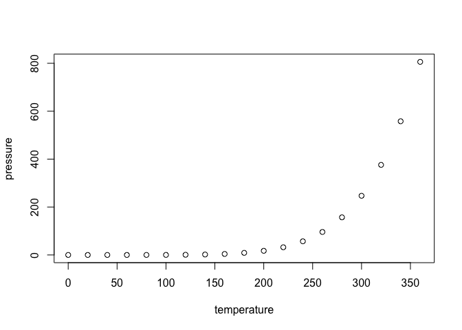

Github Document - Q9
================
Alex Zhang
2022-10-01

## Added Text Section 1: Get average

You can get the average of the numbers in a vector like this:

``` r
mean(c(1, 3, 5, 7))
```

    ## [1] 4

## Added Text Section 2: Create a dataframe

You can get the create a data frame like this:

``` r
new_df <- data.frame("id" = c(567,324,890), "name" = c('Jack', 'Sarah', 'Pete'))
new_df
```

    ##    id  name
    ## 1 567  Jack
    ## 2 324 Sarah
    ## 3 890  Pete

## R Markdown

This is an R Markdown document. Markdown is a simple formatting syntax
for authoring HTML, PDF, and MS Word documents. For more details on
using R Markdown see <http://rmarkdown.rstudio.com>.

When you click the **Knit** button a document will be generated that
includes both content as well as the output of any embedded R code
chunks within the document. You can embed an R code chunk like this:

``` r
summary(cars)
```

    ##      speed           dist       
    ##  Min.   : 4.0   Min.   :  2.00  
    ##  1st Qu.:12.0   1st Qu.: 26.00  
    ##  Median :15.0   Median : 36.00  
    ##  Mean   :15.4   Mean   : 42.98  
    ##  3rd Qu.:19.0   3rd Qu.: 56.00  
    ##  Max.   :25.0   Max.   :120.00

## Including Plots

You can also embed plots, for example:

<!-- -->

Note that the `echo = FALSE` parameter was added to the code chunk to
prevent printing of the R code that generated the plot.
